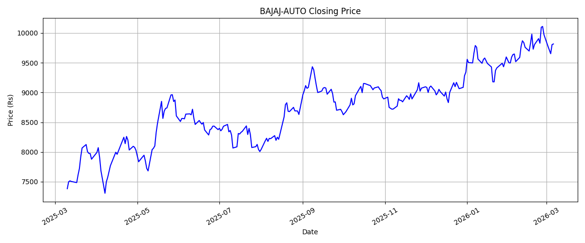
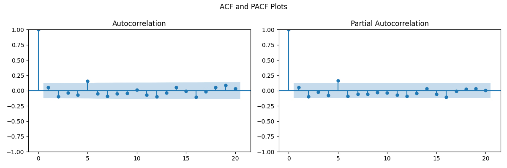
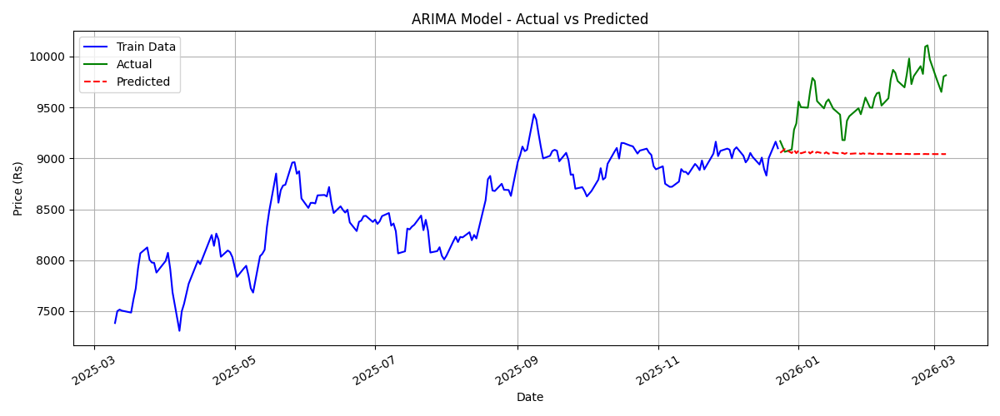
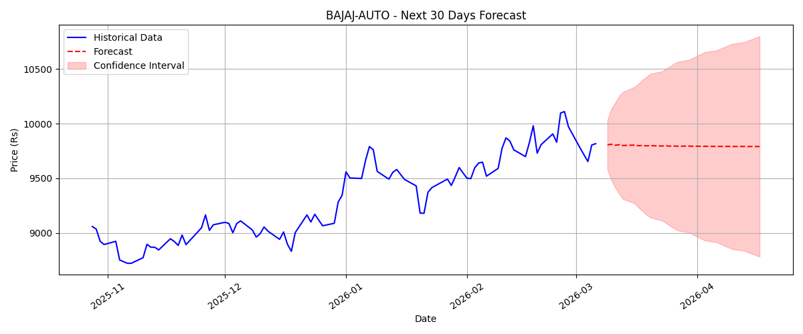

# BAJAJ-AUTO Stock Analysis — ARIMA Time Series Forecasting

**Course:** Data Analytics and Visualization     
**Stock Assigned:** BAJAJ-AUTO (NSE)  
---

## Files in this Repository

- `analysis.py` — Python code for complete analysis
- `BAJAJ_AUTO.csv` — Historical dataset downloaded from NSE India
- `forecast_30days.csv` — 30 day forecasted prices output
- `01_closing_price.png` — Closing price trend graph
- `02_acf_pacf.png` — ACF and PACF plots
- `03_arima_eval.png` — ARIMA model evaluation graph
- `04_forecast.png` — 30 day forecast graph

---

---

## Graphs

### 1. Closing Price Trend

### 2. ACF and PACF Plots

### 3. ARIMA Model — Actual vs Predicted

### 4. 30 Day Forecast

---

## Summary of Findings

- Downloaded 1 year of BAJAJ-AUTO daily closing prices from NSE India
- Converted date column to datetime format and removed commas from price values
- No missing values were found in the dataset
- ADF test showed the original series was non-stationary so d = 1 was used
- After first differencing the series became stationary
- ACF and PACF plots were used to select p = 2 and q = 2
- ARIMA(2,1,2) model was fitted on 80% training data and tested on 20% test data
- Model performance was measured using RMSE, MAE and MAPE
- The trained model was used to forecast the next 30 trading days
- Based on the forecast BAJAJ-AUTO shows a stable to slight upward trend

---

## AI Ethics & Responsible Usage Declaration

[Click here to view AI Ethics Declaration](AI_Ethics_Declaration_Page.pdf)

---

## References

1. NSE India Historical Data — https://www.nseindia.com
2. statsmodels ARIMA — https://www.statsmodels.org/stable/generated/statsmodels.tsa.arima.model.ARIMA.html
3. ADF Test — https://www.statsmodels.org/stable/generated/statsmodels.tsa.stattools.adfuller.html
4. ARIMA Guide — https://www.geeksforgeeks.org/python-arima-model-for-time-series-forecasting/
